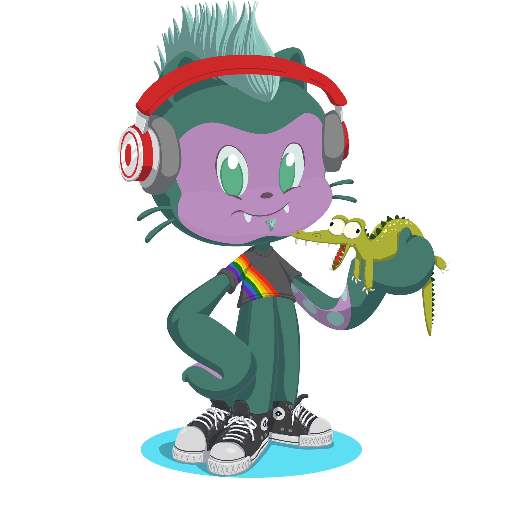

# Bienvenido a mi perfil 🕹️💻

¡Hola! 😄

Me llamo `Víctor` y actualmente estoy en proceso de convertirme en un gran programador.

Estoy estudiando un grado superior de **Desarrollo de aplicaciones multiplataforma**.

Programar me brinda la oportunidad de desarrollar mis ideas como un proyecto personal en mi día a día. Soy una persona que se ha criado con videojuegos y siempre me ha atraído la atención todo lo que podría haber detrás. Además tengo algunos proyectos en proceso que iré desarrollando a medida que vaya ampliando mis conocmientos.

Disfruto mucho una tarde en buena compañía, jugando videojuegos o viendo alguna serie o simplemente charlando.

---

## `Octogato`

